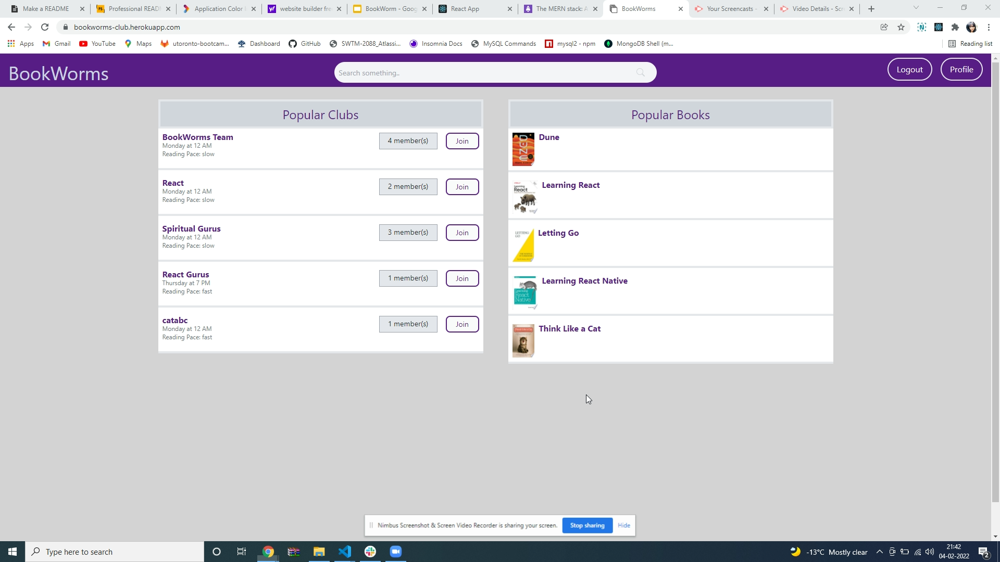

# BookWorms


## Description

BookWorm is an app that empowers avid readers to not only choose and read their favorite books but also provide the ability to join a like-minded community of readers to discuss and critique books based on their genre, characteristics, author and content. The app also provides the ability for readers to create their own book or club and share them with their network of friends.

## Motivation

With the pandemic making it difficult for people to meet in person, it has become more and more evident that virtual space is the way to go. Providing an opportunity to hone a hobby such as reading and being able to collaborate with a network of like-minded people virtually to share experiences and thoughts has been the key motivator of developing BookWorms which enhances the overall experience of avid readers.

## What problem does it solve!

Books are your best friend. When a reader read new book he or she can share about their thoughts, like and dislike about that particular book. Their knowledge from reading might be helpful for other readers too.

## Table of Contents

- [Build With](#build-with)
- [Prerequisites](#prerequisites)
- [Installation](#installation)
- [Usage](#usage)
- [Demo](#demo)
- [License](#license)
- [Features](#features)
- [Contributors](#contributors)

## Build With

- JavaScript
- Google API
- Graphql
- React
- Redux
- Apollo server
- Bcrypt
- Express
- Jsonwebtoken
- Mongoose
- Tailwind
- Diagram.net - Wireframe

## Prerequisites

Clone the repo

```
git clone https://github.com/maplesyrupman/bookworms
```

## Installation

Install NPM packages and other dependencies.

```
npm install
npm i express mongoose body-parser bcryptjs validation
npm i -D nodemon
```

## Usage

```
npm run develop
```

## Demo

Video Link of the application:

[](https://youtu.be/LdyFAzjKhIY)

Live URL:

https://bookworms-club.herokuapp.com/

## License

[](https://opensource.org/licenses/ISC)

---

## Features

- User signup
- User login
- Book search
- Bookclub create
- Event add
- Profile page with created bookclub list and events
- User as a member can join club
- Members can have discussion on particular book

## Contributors

- William Weiland - [Github](https://github.com/maplesyrupman)
- Varsha Jain - [Github](https://github.com/vjain83)
- Rhoda Evangelene - [Github](https://github.com/rhodaevangelene)
- Daniel Subramanian - [Github](https://github.com/dan13l80)
